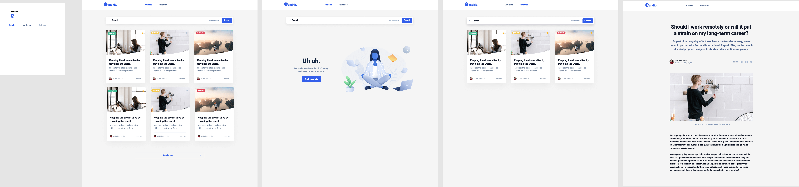

# :gear: Landkit :gear:

## Resources
* [Fonts](https://css-tricks.com/snippets/css/using-font-face/): [Web Fonts](https://drive.google.com/file/d/1xfE30WF5E-1YuJJ9owwn6E9PIXadzYSv/view?usp=sharing) + [Font Pack](https://fonts.google.com/specimen/Roboto?preview.text_type=custom)
* [HTML Semantic elements](https://www.w3schools.com/html/html5_semantic_elements.asp)
* [SASS tutorial](https://www.w3schools.com/sass/)
* [BEM](http://getbem.com/introduction/)
* [Udemy Learning Path](https://koombea.udemy.com/learning-paths/956006?utm_medium=email&utm_campaign=email&utm_source=sendgrid.com)

## Requirements
- The page must be built with valid HTML/CSS/Javascript.
- CSS code should be as reusable and scalable as possible.
- Use SCSS as much as possible. Do not use Bootstrap or any other CSS framework.
- The page should adapt to the screen size and resolution of the device.

## Design

## General 
- The code was worked with the BEM structure and the styling was done with SASS a CSS's processor.

- The PNG images was optimized with the following website: https://tinypng.com/

- The SVG images was optimized with the following website: https://jakearchibald.github.io/svgomg/

- The URL of the project is as follows: https://landkit-project.netlify.app/

- To run it, should write the follow comand on your console/terminal: json-server --watch db.json

## Author :book:
**Tatiana Peña** :computer: :woman: 

- Github - [tatianapena](https://github.com/tatianapena)
- Twitter - [@TatianaPenaM](https://twitter.com/TatianaPenaM)
- LinkedIn - [tatianapenam](https://www.linkedin.com/in/tatianapenam/)

